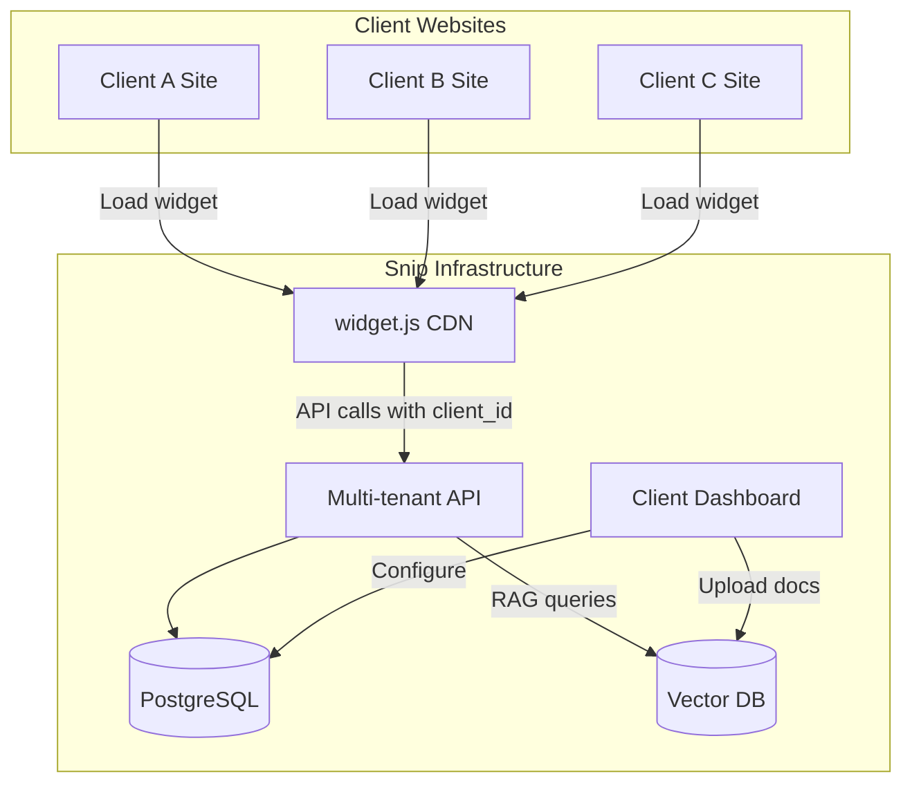
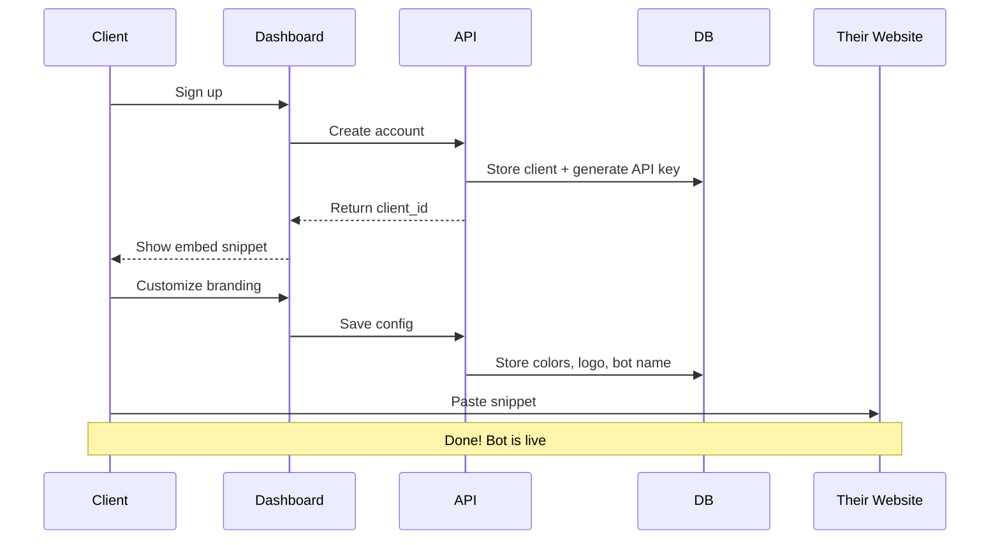
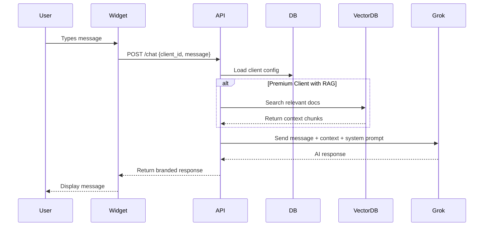
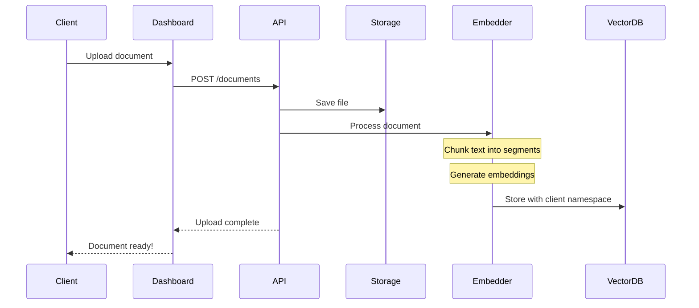
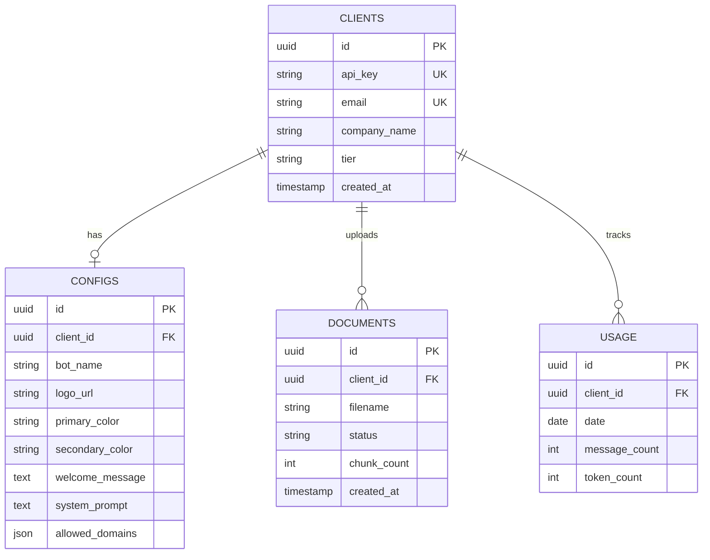

# Snip - Architecture Overview

## System Architecture



## How It Works

### 1. Client Onboarding Flow



### 2. Chat Request Flow



### 3. Document Upload Flow (Premium)



## Technology Stack

| Component | Technology | Purpose |
|-----------|------------|---------|
| **Widget** | Vanilla JS (Vite build) | Embeddable script for client websites |
| **API** | FastAPI + Python | Multi-tenant backend |
| **Database** | PostgreSQL | Clients, configs, usage tracking |
| **Vector DB** | ChromaDB or Pinecone | Document embeddings for RAG |
| **AI Model** | xAI Grok 4.1 | Chat responses |
| **Dashboard** | React + TypeScript | Client configuration portal |
| **Hosting** | Vercel + Railway | Scalable deployment |

## Data Model



## Tier Features

| Feature | Basic | Premium |
|---------|-------|---------|
| Custom bot name | ✓ | ✓ |
| Custom colors | ✓ | ✓ |
| Custom logo | ✓ | ✓ |
| Welcome message | ✓ | ✓ |
| System prompt customization | ✓ | ✓ |
| Document upload (RAG) | ✗ | ✓ |
| Priority support | ✗ | ✓ |
| Analytics dashboard | Basic | Advanced |

## Widget Embed Code

What clients paste on their website:

```html
<script 
  src="https://snip.yourdomain.com/widget.js" 
  data-client-id="abc123"
  async>
</script>
```

That's it - one line, and the branded chatbot appears on their site.

## Security Considerations

- API keys are hashed before storage
- Client IDs validated on every request
- Domain allowlisting prevents unauthorized usage
- Rate limiting per client
- Document uploads scanned and sanitized
- CORS configured per client's domains
